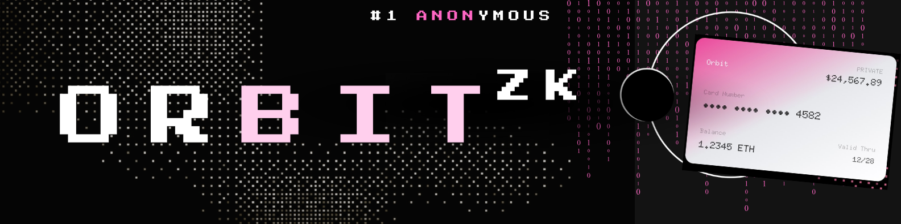

<p align="center">
  
</p>

<h1 align="center">Orbit</h1>

<p align="center">
  <strong>Privacy-First Stablecoin Transfers</strong>
</p>

<p align="center">
  <em>Because your crypto balance is nobody's business but yours.</em>
</p>

---

## Table of Contents

- [The Problem](#the-problem)
- [The Solution](#the-solution)
- [Core Features](#core-features)
  - [zkWormhole](#zkwormhole)
  - [zkSwap](#zkswap)
- [Technical Challenges](#technical-challenges)
- [Tech Stack](#tech-stack)
- [Quick Start](#quick-start)
- [Tracks Applied](#tracks-applied)

---

## The Problem

When you send someone USDC, they can look up the transaction on Etherscan and **see your entire wallet balance** - every token, every transaction, your complete financial history exposed from a simple payment.

This creates real problems:

| Scenario | Privacy Risk |
|----------|--------------|
| Payroll transactions | Coworkers can **figure out your salary** |
| Freelance payments | Clients can **see all your other clients** and what they're paying you |
| Business spending | Competitors can **analyze your business operations** |
| Holding significant crypto | Visible wealth creates security risks - scammers target rich wallets |

There's even a term for the worst case: the **"$5 wrench attack"** where someone threatens you physically because they know exactly how much you're worth.

Traditional finance solved this decades ago. Venmo doesn't show your bank balance. Credit cards don't expose your history. But in crypto, every transaction is a public declaration of your wealth.

---

## The Solution

**Orbit fixes this using zero-knowledge proofs.** When you send USDC through Orbit, the recipient gets their money but **can't see where it came from**, can't look up your balance, can't trace your history. The payment appears from an **unlinkable address** - exactly how payments should work.

### How It Works

1. Your tokens get **"shielded"** into RAILGUN's private pool
2. We generate a **ZK proof** that mathematically proves you can spend those tokens *without revealing which ones or who you are*
3. The recipient gets paid through an **"unshield"** transaction with **zero on-chain connection** to the original

The cryptography makes linking them impossible, not just difficult.

---

## Core Features

### zkWormhole

Private peer-to-peer transfers with complete on-chain unlinkability.

**Concept**

<p align="center">
  
</p>

**Implementation**

<p align="center">
  
</p>

**Key Components:**

- **Waku Relayer + Groth16 proofs** - Decentralized proof relay with zkSNARK verification
- **UTXO + SpendKey model** - Unspent transaction outputs for enhanced privacy
- **EIP-2612 Permits** - Gasless signatures for seamless UX
- **Proof of Innocence** - Verification layer ensuring fund legitimacy

---

### zkSwap

Private token swaps across chains with aggregated routing.

**Concept**

<p align="center">
  
</p>

**Implementation**

<p align="center">
  
</p>

**Key Components:**

- **Shielded swap execution** - Swap tokens without exposing wallet history
- **Multi-DEX aggregation** - Routes through Uniswap, 1inch, LI.FI, Mayan for best rates
- **Cross-chain support** - Private swaps across different networks
- **Relayer swap executioner** - Handles all on-chain complexity

---

## Technical Challenges

### Bun Worker Crashes
ZK proof generation uses worker threads, and Bun's implementation has bugs causing ~30% of proofs to fail silently. We use Node.js (`npx tsx`) for proof-heavy operations while keeping Bun for the frontend.

### POI Timing Confusion
After shielding, there's a 60-90 second "Proof of Innocence" verification before funds become spendable. Users saw tokens but couldn't spend them. We split balance into **"spendable" vs "pending POI"** with a countdown timer.

### Encryption Key Mismatches
Client-side and server-side key derivation produced different results due to encoding differences, causing "wallet not found" errors. We **cache the canonical key server-side** on wallet creation.

### Gas Abstraction
We wanted zero-gas UX but Ethereum needs ETH for every transaction. We use **EIP-2612 permits** (gasless signatures) plus a relayer that executes and pays for all on-chain operations.

### Multi-Token Batches
RAILGUN only supports one token per ZK proof, but users want to pay Alice in USDC and Bob in DAI together. We **group by token**, shield each separately, wait for POI in parallel, then generate proofs sequentially with balance sync waits between each.

### Real-Time Updates
Transfers take 2-3 minutes and Next.js doesn't support SSE natively. We built a custom **ReadableStream implementation** that pushes progress events to the client.

---

## Tech Stack

| Category | Technologies |
|----------|-------------|
| **Frontend** | Next.js 16, React 19, TailwindCSS, Framer Motion, Three.js |
| **Web3** | wagmi, viem, RainbowKit |
| **Privacy** | RAILGUN Protocol, snarkjs (Groth16) |
| **Standards** | EIP-2612, EIP-7702 |
| **Extension** | Chrome Extension Manifest V3 |
| **Storage** | LevelDB |

---

## Quick Start

```bash
# Clone the repository
git clone https://github.com/anomalyco/orbitux.git && cd orbitux

# Install dependencies
bun install

# Configure environment
cp .env.example .env.local  # Add RELAYER_PRIVATE_KEY and RPC URL

# Start development server
bun dev
```

---

## Tracks Applied

- Privacy and Security
- DeFi / Payments
- User Experience
- Account Abstraction
